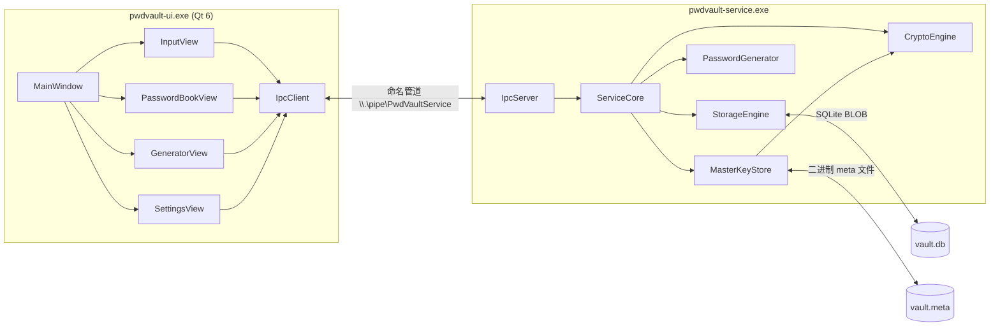

# PwdVault 架构设计

本文档描述 PwdVault 的整体架构、模块分层、数据流与密钥层次结构，并给出扩展指南。
开发者构建步骤请参见 [BUILD.md](BUILD.md)；IPC 协议详细说明请参见 [IPC_PROTOCOL.md](IPC_PROTOCOL.md)；
安全设计与威胁模型请参见 [SECURITY.md](SECURITY.md)。

## 1. 项目目标与设计原则

PwdVault 是一个本地优先的密码管理器，目标是提供透明、可信、可控的密码安全管理体验。

设计原则：

- **零云端**：默认不与任何远程服务通信，所有数据保存在用户本地。
- **进程隔离**：将 UI（不可信、易崩溃）与敏感操作（加解密、密钥派生）拆分为独立进程，
  降低 UI 崩溃对敏感内存的影响面。
- **接口先行**：所有引擎（crypto / storage / generator）以抽象接口（`ICryptoEngine` /
  `IStorageEngine` / `IPasswordGenerator`）暴露，便于替换实现与单元测试注入。
- **现代 C++**：C++20，使用 `std::span`、`std::expected` 风格的 `Result<T>` 类型，禁用异常
  跨进程边界传递。
- **零拷贝协议**：IPC 使用二进制 TLV 序列化，小端序、定长头部 + 变长负载，避免 JSON
  解析开销与外部依赖。

## 2. 双进程架构

PwdVault 采用模仿火绒安全软件的双进程架构：

```
┌──────────────────────┐         ┌──────────────────────────────┐
│   pwdvault-ui.exe    │         │   pwdvault-service.exe       │
│   (Qt 6 Widgets)     │         │   (控制台进程)               │
│                      │         │                              │
│  ┌────────────────┐  │  命名   │  ┌────────────────────────┐  │
│  │ MainWindow     │  │  管道   │  │ IpcServer              │  │
│  │  ├ InputView   │──┼─────────┼──│  ├ listener_loop      │  │
│  │  ├ PasswordBook│  │ 命名    │  │  └ client_loop (x N)  │  │
│  │  ├ GeneratorView│ │ 管道    │  └──────────┬─────────────┘  │
│  │  └ SettingsView│  │ 读写    │             │                │
│  └─────┬──────────┘  │         │  ┌──────────▼─────────────┐  │
│        │             │         │  │ ServiceCore            │  │
│  ┌─────▼──────────┐  │         │  │  ├ handle_request      │  │
│  │ IpcClient      │  │         │  │  ├ login / unlock /    │  │
│  │  ├ serialize   │──┼─────────┼──│  │   lock 状态机        │  │
│  │  ├ write_frame │  │         │  │  └ entry 加解密        │  │
│  │  └ read_frame  │  │         │  └───┬───────┬───────┬─────┘  │
│  └────────────────┘  │         │      │       │       │        │
└──────────────────────┘         │  ┌───▼───┐ ┌─▼────┐ ┌▼──────┐ │
                                 │  │Crypto │ │Storage│ │Generator│
                                 │  │Engine │ │Engine│ │       │ │
                                 │  └───┬───┘ └──┬───┘ └───┬───┘ │
                                 │      │        │          │     │
                                 │  ┌───▼──────┐ │          │     │
                                 │  │vault.meta│ │          │     │
                                 │  │vault.db  │◄┘          │     │
                                 │  └──────────┘            │     │
                                 └──────────────────────────────────┘
```

### Mermaid 版本



## 3. SDK 模块分层

SDK（`src/sdk/`）以分层抽象组织，每层只依赖下一层：

```
┌──────────────────────────────────────────────────────────┐
│ service / ui 进程                                          │
├──────────────────────────────────────────────────────────┤
│ protocol    IPC 协议层（CommandId / Messages / Serializer）│
├──────────────────────────────────────────────────────────┤
│ crypto      AES-256-GCM + Argon2id 引擎                  │
│ storage     SQLite 持久化 + InMemory 实现                │
│ generator   密码生成与强度估算                            │
├──────────────────────────────────────────────────────────┤
│ core        通用类型（ByteVec/ByteSpan/Result/Error）    │
│             抽象接口（ICryptoEngine/IStorageEngine/IPasswordGenerator）│
└──────────────────────────────────────────────────────────┘
```

| 模块        | 路径                  | 类型               | 职责                                  |
|-------------|------------------------|--------------------|----------------------------------------|
| core        | `src/sdk/core/`        | INTERFACE 库       | 核心类型、错误码、抽象接口             |
| crypto      | `src/sdk/crypto/`      | STATIC 库          | AES-256-GCM 加密、Argon2id 派生        |
| storage     | `src/sdk/storage/`     | STATIC 库          | SQLite 持久化、内存实现                |
| generator   | `src/sdk/generator/`   | STATIC 库          | 密码生成（BCryptGenRandom）、强度估算  |
| protocol    | `src/sdk/protocol/`     | STATIC 库          | IPC 命令枚举、消息结构、二进制序列化   |
| **聚合**    | `PwdVault::Sdk`        | INTERFACE 别名     | 上述五子模块统一引用入口               |

CMake 目标命名约定：`pwdvault-<module>`（小写连字符），别名 `PwdVault::<Module>`（驼峰）。

## 4. 数据流

以 UI 调用 `add_entry` 为例，完整的字节级数据流：

```
1. UI 视图层（PasswordBookView）
   构造 core::PasswordEntry{website, username, password, note}
        │
        ▼
2. UI IpcClient::add_entry(entry)
   protocol::serialize(AddEntryRequest{entry})  →  ByteVec payload
   protocol::pack_message(CommandId::AddEntry, request_id, payload)
        →  ByteVec frame = MessageHeader(16) + payload
        │
        ▼
3. 命名管道 \\.\pipe\PwdVaultService
   WriteFile(frame) → 等待 ReadFile(响应)
        │
        ▼
4. service IpcServer::client_loop
   ReadFile → parse_header → ByteSpan payload + MessageHeader header
        │
        ▼
5. ServiceCore::handle_request(payload, header)
   switch (header.command) {
     case CommandId::AddEntry:
       deserialize<AddEntryRequest>(payload)
       → encrypt_entry(entry)        // 用 entry_crypto_ 加密 password 字段
         → AES-256-GCM encrypt → [IV(12) || ciphertext || tag(16)]
         → 拆分 iv / password(密文) / tag
       → storage_->add_entry(encrypted_entry)
         → SQLite INSERT INTO entries(...)
       → 构造 AddEntryResponse{明文 entry + 分配的 id + 时间戳}
       → protocol::serialize(AddEntryResponse) → ByteVec response_payload
   }
        │
        ▼
6. service IpcServer
   构造响应 header（command/request_id 与请求一致）
   WriteFile → 写回管道
        │
        ▼
7. UI IpcClient
   ReadFile → parse_header → read payload
   → 优先 deserialize<AddEntryResponse>
   → 失败则 deserialize<ErrorResponse>，转 core::Error 返回
        │
        ▼
8. UI 视图层
   add_entry Result 成功 → 显示新条目
   失败 → 弹出错误提示
```

## 5. 主密码与密钥层次结构

PwdVault 采用三层密钥派生，最大限度保护用户数据：

```
┌─────────────────────────────────────────────────────────────┐
│ 用户主密码（master_password）                                │
│   - 用户在 LoginView 输入的明文口令                          │
│   - 仅在 UI 内存中短暂存在，IPC 传输后由 service 持有        │
└────────────────────────────────┬────────────────────────────┘
                                 │ Argon2id（libsodium）
                                 │   ops_limit = INTERACTIVE
                                 │   mem_limit = INTERACTIVE
                                 │   salt = 16B（持久化于 vault.meta）
                                 ▼
┌─────────────────────────────────────────────────────────────┐
│ KEK（Key Encryption Key，32 字节）                          │
│   - 仅存在于 service 进程内存                                │
│   - 用于加密 / 解密 master_key                              │
│   - 函数返回前用 sodium_memzero 清零                       │
└────────────────────────────────┬────────────────────────────┘
                                 │ AES-256-GCM（KEK 作为 master_key）
                                 ▼
┌─────────────────────────────────────────────────────────────┐
│ master_key（32 字节，entry 加密用主密钥）                    │
│   - 在 service 内存中存活（unlock 后 → lock 前）            │
│   - 持久化为 [IV(12) || ciphertext(32) || tag(16)] 于 vault.meta│
│   - lock() 或进程退出时 sodium_memzero 清零                 │
└────────────────────────────────┬────────────────────────────┘
                                 │ AES-256-GCM（每个 entry 独立 IV）
                                 ▼
┌─────────────────────────────────────────────────────────────┐
│ 加密后的 entry.password                                     │
│   - 持久化于 vault.db 的 entries 表                          │
│   - iv / password(密文) / tag 三段分别存于不同列             │
└─────────────────────────────────────────────────────────────┘
```

### Meta 文件格式

`vault.meta` 采用自定义二进制格式：

| 偏移 | 长度      | 字段             | 说明                                       |
|------|-----------|------------------|--------------------------------------------|
| 0    | 4         | magic            | `0x4D4B5650`（'P','V','K','M' 小端）       |
| 4    | 2         | version          | `1`                                        |
| 6    | 4         | salt_len         | `16`                                       |
| 10   | 16        | salt             | Argon2id 派生盐                            |
| 26   | 4         | blob_len         | `60`（12 IV + 32 密文 + 16 tag）           |
| 30   | blob_len  | encrypted_blob   | `[IV(12) || ciphertext(32) || tag(16)]`    |

## 6. 安全设计

详见 [SECURITY.md](SECURITY.md)。要点：

- **KEK 仅内存**：KEK 在 `MasterKeyStore::initialize / unlock` 函数返回前通过 `sodium_memzero` 清零。
- **敏感数据清零**：master_key、KEK、派生密钥、明文密码字符串均用 `sodium_memzero` 清零。
- **GCM 认证**：每条 entry 的 password 字段独立 IV + tag，GCM 校验失败即拒绝解密。
- **常量时间比较**：`CryptoEngine::verify_password` 使用 `sodium_memcmp`，避免时序侧信道。
- **登录限速**：连续 5 次主密码错误后锁定 5 分钟，期间任何 unlock 尝试直接返回失败。
- **自动退出**：service 进程 30 秒无客户端连接即自动退出，缩小敏感数据存活窗口。

## 7. 可扩展性

### 7.1 新增 IPC 命令

按以下步骤追加新命令（如 `Backup`）：

1. **Commands.h**：在 `CommandId` 枚举中追加新值（保持值唯一且不复用旧值）：
   ```cpp
   Backup = 0x0400,  // 新命令分组 0x04xx
   ```
2. **Messages.h**：定义请求 / 响应结构：
   ```cpp
   struct BackupRequest { std::string target_path; };
   struct BackupResponse { int64_t bytes_copied = 0; };
   ```
3. **Serializer.h / Serializer.cpp**：追加 `serialize<BackupRequest>` /
   `serialize<BackupResponse>` 与对应 `deserialize` 特化声明 + 实现。
4. **ServiceCore.h / ServiceCore.cpp**：
   - 在 `handle_request` switch 中追加 `case CommandId::Backup: return handle_backup(payload);`
   - 实现 `handle_backup(core::ByteSpan payload)` 私有方法。
5. **IpcClient.h / IpcClient.cpp**：追加 `Result<BackupResponse> backup(const std::string& path);`。
6. **测试**：在 `tests/protocol/test_protocol.cpp` 追加 round-trip 用例；
   在 `tests/integration/test_e2e_flow.cpp` 追加端到端用例。

### 7.2 新增引擎实现

替换存储引擎为例（如改用 LevelDB）：

1. 在 `src/sdk/storage/` 下新增 `LevelDBStorageEngine.h` 与 `.cpp`，
   继承 `core::IStorageEngine` 接口。
2. 在 `src/sdk/storage/CMakeLists.txt` 中将新源文件加入 `pwdvault-storage` STATIC 库的源列表，
   并通过 vcpkg 添加 LevelDB 依赖。
3. 在 `src/service/main.cpp` 中将 `StorageEngine(db_path)` 替换为
   `LevelDBStorageEngine(db_path)`，构造注入 `ServiceCore`。
4. 重新运行 `ctest` 验证全部测试用例仍然通过（接口契约保证可替换性）。

### 7.3 新增 UI 视图

1. 在 `src/ui/views/` 下新增 `XxxView.h` 与 `.cpp`，继承 `QWidget`。
2. 在 `src/ui/CMakeLists.txt` 中将新源文件加入 `pwdvault-ui` 目标。
3. 在 `MainWindow` 中添加对应 Tab/侧边栏入口。
4. 视图通过 `IpcClient` 与 service 通信，不直接持有引擎实现。

## 8. 相关文档

- [BUILD.md](BUILD.md)：开发者构建指南与环境配置
- [IPC_PROTOCOL.md](IPC_PROTOCOL.md)：IPC 协议帧格式与命令列表
- [SECURITY.md](SECURITY.md)：威胁模型与加密方案
- [../README.md](../README.md)：项目概览
